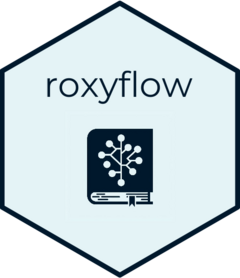

<!-- README.md is generated from README.Rmd. Please edit that file -->

```{r, include = FALSE}
knitr::opts_chunk$set(
  collapse = TRUE,
  comment = "#>",
  fig.path = "man/figures/README-",
  out.width = "100%"
)
```

# roxyflow 

<!-- badges: start -->

<!-- badges: end -->

The goal of `roxyflow` is to provide custom `roxygen2` tags and roclets for adding diagrams to package documentation. Diagrams are created with the [\`flow\` package](https://github.com/moodymudskipper/flow).

## Installation

You can install the development version of roxyflow like so:

``` r
renv::install("PatrickCoyle/roxyflow")
```

## Example
